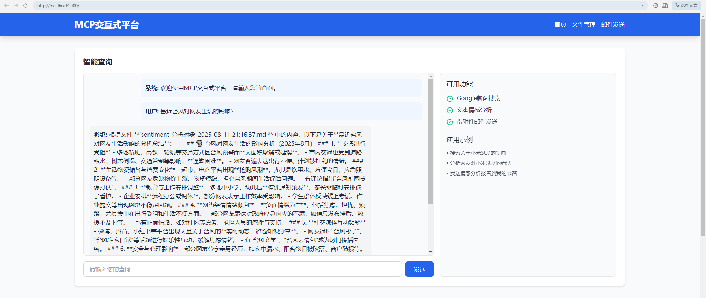
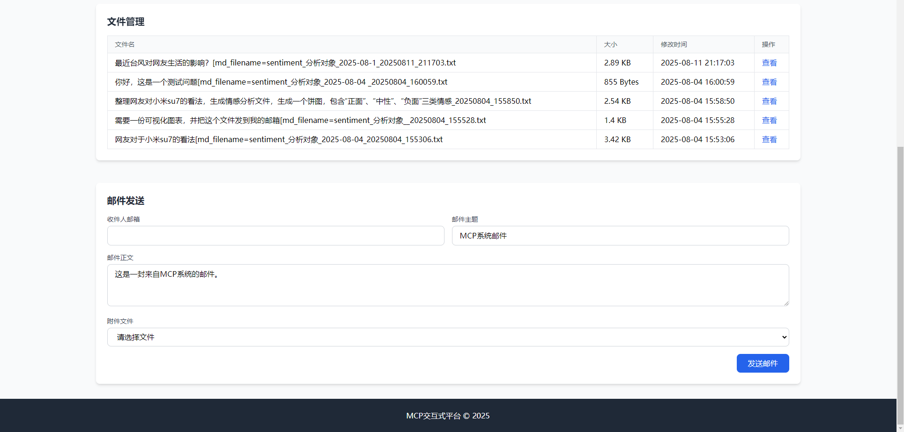

# 文章情感分析报告自动生成

## 项目简介
集成多种AI能力的交互式Web平台，旨在通过连接mcp server提供便捷的智能查询、情感分析、新闻搜索、文件管理、邮件附件转发等功能。采用模块化设计，通过Flask构建后端，同时结合前端设计，实现了直观友好的用户界面。

## 功能特点
- **智能查询处理**：通过集成OpenAI模型实现自然语言交互
- **Google新闻搜索**：实时获取相关新闻资讯并保存分析结果
- **文本情感分析**：对输入文本进行情感倾向分析并生成可视化报告
- **文件管理**：上传、查看和管理各类文件
- **邮件发送**：支持带附件的邮件发送功能
- **响应式设计**：适配不同设备的浏览器访问

## 技术栈
- **后端**：Python, Flask
- **前端**：HTML, JavaScript, Tailwind CSS, Chart.js
- **AI集成**：OpenAI API, Google搜索API
- **其他库**：asyncio, dotenv, httpx, email-validator

## 环境要求
- Python 3.8+ (推荐使用项目指定的Python版本，见`.python-version`文件)
- 有效的API密钥 (OpenAI, Google)
- 邮件服务器配置

## 安装步骤
1. **克隆仓库**
   ```bash
   git clone https://github.com/yourusername/mcp-project.git
   cd mcp-project
   ```

2. **创建虚拟环境**
   ```bash
   python -m venv venv
   # Windows
   venv\Scripts\activate
   # macOS/Linux
   source venv/bin/activate
   ```

3. **安装依赖**
   ```bash
   pip install -r requirements.txt
   ```

4. **配置环境变量**
   创建`.env`文件，添加以下内容：
   ```
   QWEN_API_KEY=your_openai_api_key
   BASE_URL=your_api_base_url
   MODEL=your_model_name
   GOOGLE_API_KEY=your_google_api_key
   SMTP_SERVER=your_smtp_server
   SMTP_PORT=your_smtp_port
   SMTP_USER=your_smtp_username
   SMTP_PASSWORD=your_smtp_password
   ```

## 使用说明
1. **启动应用**
   ```bash
   python flask_app.py
   ```

2. **访问应用**
   在浏览器中打开：`http://127.0.0.1:5000`

3. **功能使用**
   - **智能查询**：在首页输入框中输入查询内容，点击"发送"按钮
   - **文件管理**：使用"文件管理"功能上传和查看文件
   - **邮件发送**：填写收件人、主题、正文和附件路径，点击"发送邮件"

## 项目结构
```
├── .env              # 环境变量配置
├── .gitignore        # Git忽略文件
├── README.md         # 项目说明文档
├── client.log        # 客户端日志
├── client.py         # MCP客户端实现
├── flask_app.log     # Flask应用日志
├── flask_app.py      # Flask主应用
├── llm_outputs/      # LLM输出文件目录
├── pyproject.toml    # Python项目配置
├── requirements.txt  # 依赖包列表
├── server.py         # MCP服务器实现
├── start.py          # 启动脚本
├── templates/        # HTML模板
│   └── index.html    # 主页面模板
├── test_email.py     # 邮件测试脚本
└── uploads/          # 上传文件目录
```

## 配置说明
- **API密钥**：需要有效的OpenAI和Google API密钥
- **邮件配置**：需要正确配置SMTP服务器信息
- **模型配置**：可以在`.env`文件中指定使用的模型名称

## 注意事项
1. 确保所有环境变量正确配置，特别是API密钥
2. 项目运行需要网络连接以访问外部API
3. 上传文件大小限制为16MB
4. 首次运行可能需要安装额外的系统依赖

## 许可证
[MIT License](LICENSE) - 开源免费使用，请保留原作者信息。

## 截图展示
以下是MCP交互式平台的主要页面截图：

### 首页（智能查询）


### 文件管理页面



